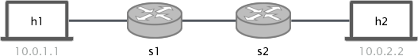
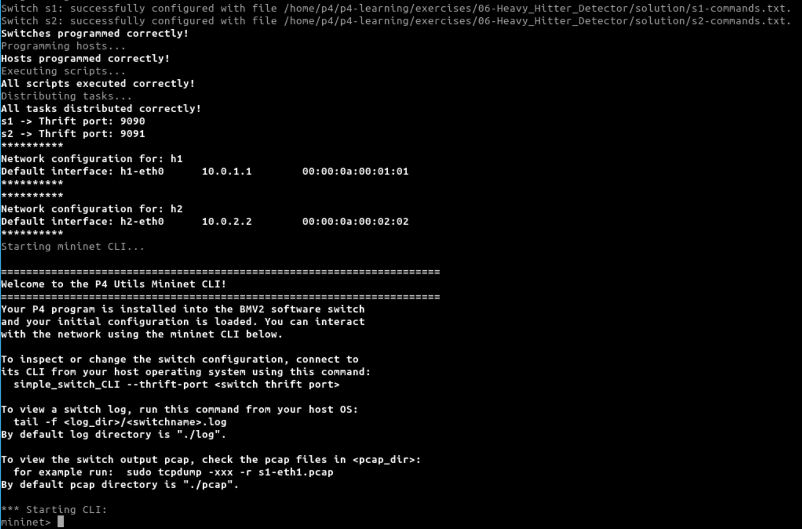
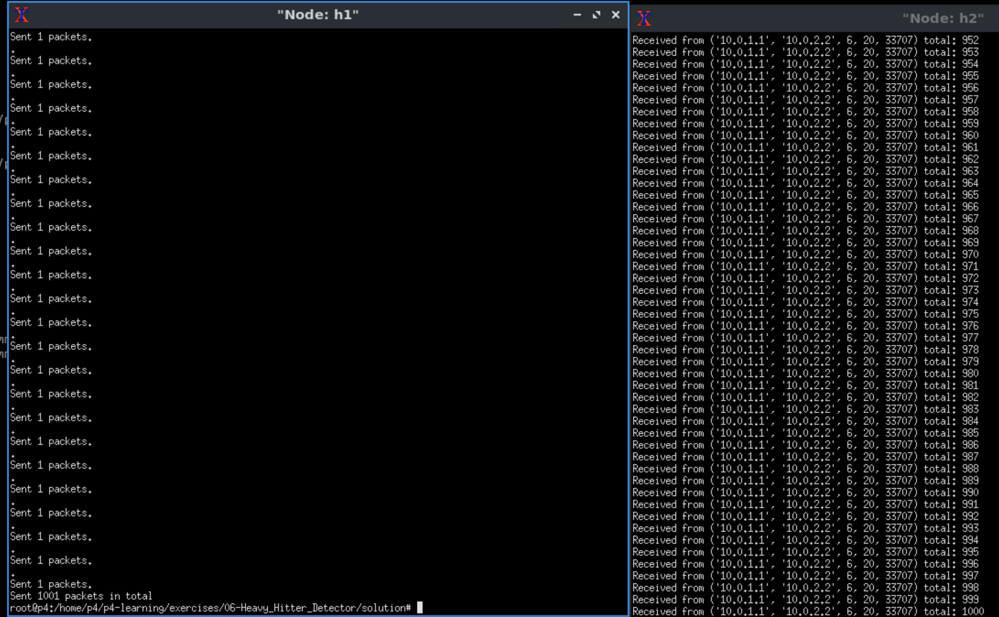

# P4 Heavy hitter
## 架構圖
### 網路拓墣


### 布隆過濾器(bloom Filter)
布隆過濾器（Bloom Filter）是一種空間效率很高的概率型資料結構，用來檢查一個元素是否在一個集合中。其主要用途包括：

1.	快速查詢：
    - 布隆過濾器可以用來快速判斷一個元素是否屬於某個集合。它的查詢速度很快，且所需的空間很少。
    - 如果布隆過濾器判定一個元素不在集合中，那麼這個判定是確定的。如果判定一個元素在集合中，則有一定的概率是錯誤的（即假陽性）。
2.	去重檢查：
    - 在需要快速檢查是否有重複數據的應用中，如網頁爬蟲檢查URL是否已經被訪問過，布隆過濾器能夠高效地進行判斷。
3.	分佈式系統中的元素存在性檢查：
    - 在大型分佈式系統中，布隆過濾器用來檢查某個元素是否存在於某一節點上，從而避免不必要的網路傳輸和資源消耗。
4.	數據庫查詢加速：
    - 在數據庫系統中，布隆過濾器可以用來快速判斷數據是否存在於磁碟或記憶體中，從而加速查詢過程。
5. 在 heavy hitter 檢測中的應用：
    - 在重流量檢測中，布隆過濾器可以用來高效地記錄和更新流量計數，幫助識別頻繁出現的流量。
    - 通過多個哈希函數計算出來的多個位置來記錄和更新流量計數，從而在保持空間效率的同時，實現對重流量的精確追蹤。

布隆過濾器的特點是能夠以很小的空間代價來實現快速的元素存在性檢查，這使得它在需要高效查詢和空間優化的應用中非常實用。

## 執行步驟

### 虛擬環境安裝
1. 先去 github [p4-guide](https://github.com/jafingerhut/p4-guide/blob/master/bin/README-install-troubleshooting.md) 下載 release VM Image link
2. 將 VM image 以 Virtual box 的方式打開
3. 登入時，選 account: `p4`，輸入 password: `p4`
4. 就可以進到桌面了

### 安裝 p4-utils
1. 使用 terminal
2. 下載 p4-utils，`git clone https://github.com/nsg-ethz/p4-utils.git`
3. 進到資料夾，並且安裝 `cd p4-utils & sudo ./install.sh`
4. 輸入 `sudo p4run` 確認安裝

## heavy hitter detector
> 可作為 DoS 攻擊的防禦機制
### 核心邏輯
程式的核心邏輯是使用布隆過濾器來追蹤並計數網路流量，特別是檢測和更新重流量（heavy hitter）的計數。以下是這段程式的核心邏輯分解：

1.	哈希計算：
   - 程式首先使用兩種不同的哈希算法（CRC16 和 CRC32）來計算封包的哈希值，這些哈希值是根據封包的五元組（源IP地址、目的IP地址、源端口、目的端口和協議類型）計算得出的。
   - 這些哈希值用來確定布隆過濾器中的位置。
2.	讀取計數器：
   - 根據計算出的哈希值，程式從布隆過濾器中讀取對應位置的計數器值。
   - 這些計數器值表示目前記錄到的流量數。
3.	更新計數器：
   - 程式將讀取到的計數器值加1，表示記錄到新的封包流量。
4.	寫入更新後的計數器值：
   - 將更新後的計數器值寫回布隆過濾器中的相應位置，從而更新流量記錄。

```p4!=
action update_bloom_filter() {
    // 計算寄存器位置
    hash(meta.output_hash_one, HashAlgorithm.crc16, (bit<16>)0, {hdr.ipv4.srcAddr, hdr.ipv4.dstAddr, hdr.tcp.srcPort, hdr.tcp.dstPort, hdr.ipv4.protocol}, (bit<32>)BLOOM_FILTER_ENTRIES);
    hash(meta.output_hash_two, HashAlgorithm.crc32, (bit<16>)0, {hdr.ipv4.srcAddr, hdr.ipv4.dstAddr, hdr.tcp.srcPort, hdr.tcp.dstPort, hdr.ipv4.protocol}, (bit<32>)BLOOM_FILTER_ENTRIES);

    // 讀取計數器
    bloom_filter.read(meta.counter_one, meta.output_hash_one);
    bloom_filter.read(meta.counter_two, meta.output_hash_two);

    // 更新計數器
    meta.counter_one = meta.counter_one + 1;
    meta.counter_two = meta.counter_two + 1;

    // 寫入更新後的計數器
    bloom_filter.write(meta.output_hash_one, meta.counter_one);
    bloom_filter.write(meta.output_hash_two, meta.counter_two);
}
```
### 撰寫 heavy hitter
1. 參考：[github p4-learning](https://github.com/nsg-ethz/p4-learning.git) 資訊，來寫 heavy hitter
2. 這邊的閾值設定為 1000，因此當封包超過 1000時就會被 block 掉

### 編譯 p4 檔案
1. 在 heavy_hitter 資料夾底下，輸入 `sudo p4run`
2. 就可以看到 mininet 畫面
3. 輸入 `xterm h1 h2` 會產生對應 h1, h2 的終端機
4. h2(接收端): 在 h2 terminal 輸入，`sudo python3 receive.py`
5. h1(發送端): 在 h1 terminal 輸入，`sudo python3 send.py 10.0.2.2 1001`


## 執行結果
- 啟動 mininet
  
- heavy hitter success
  可以看到 sender 發送 1001 個封包，但是在 receiver 只收到 1000 個封包就不再接收了
  
    

## 參考資料
1. 論文參考：[heavy hitter paper](https://ieeexplore.ieee.org/stamp/stamp.jsp?tp=&arnumber=8967165)
2. github: [p4 tuturial](https://github.com/p4lang/tutorials/tree/master)
3. github: [p4 learning](https://github.com/nsg-ethz/p4-learning)
4. github: [p4-guide](https://github.com/jafingerhut/p4-guide/blob/master/bin/README-install-troubleshooting.md)
5. github: [p4-utils](https://github.com/nsg-ethz/p4-utils)
6. 網路資源：[hackmd](https://hackmd.io/@KimLin/rJSWM9y6h)